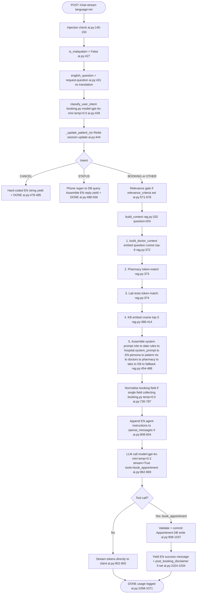
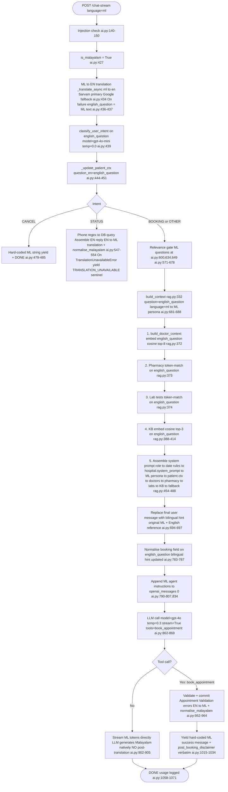

# M-01 — AROGYA Pipeline Map (read-only snapshot)

**Date:** 2026-10-01
**Branch:** research/M-01-pipeline-map
**Author:** Antigravity agent session
**Status:** DRAFT — pending lead review (G1)
**Base commit:** 952b7ab (origin/main)

Every claim below carries an exact `file:line` reference.
All line numbers are valid on the commit that introduced this note.

---

## 1. Entry point — `/chat-stream`

Route: `POST /api/v1/ai/chat-stream`
Defined at: `backend/app/api/v1/endpoints/ai.py:425`

Request model `ChatRequest` (`ai.py:126-138`):

| Field | Type | Notes |
|---|---|---|
| `question` | `str` | Validated 1-500 chars; NFKC-normalised; injection-scanned before route |
| `hospital_id` | `int` | Tenant discriminator — passed through every downstream call |
| `language` | `"en"` or `"ml"` | Validated against `VALID_LANGUAGES = {"en", "ml"}` (`ai.py:83`) |
| `history` | `list[HistoryMessage]` | Optional; up to `MAX_HISTORY_TURNS = 10` (`ai.py:80`) |
| `session_token` | `str` | Default `"default"`; used as Redis key component |

Injection guard runs inside `@field_validator("question")` at `ai.py:140-150`,
calling `detect_prompt_injection()` from `backend/app/services/security.py`.

---

## 2. Step-by-step English path (`language == "en"`)

### 2a. Pre-processing (English)

| Step | Code location | What happens |
|---|---|---|
| `is_malayalam = False` | `ai.py:427` | Flag set; ML-specific branches skipped |
| `english_question = request.question` | `ai.py:431` | No translation; question used as-is |
| `classify_user_intent(english_question, history)` | `ai.py:439` | LLM call via `booking.py`; returns `BOOKING / STATUS / CANCEL / OTHER` |
| `_update_patient_ctx(...)` | `ai.py:444-451` | Redis session context updated (turn count, language, dept, seen topics) |
| Relevance-gate override | `ai.py:455-457` | If patient mid-gate and intent != CANCEL, intent forced to `BOOKING` |

### 2b. Intent branches (English)

**CANCEL** (`ai.py:477-485`): Hard-coded English string yielded directly; stream ends.

**STATUS** (`ai.py:488-556`): Phone regex against question + history; DB query on `Appointment`
filtered by `hospital_id` + `patient_phone`; reply assembled in English; no translation; stream ends.

**BOOKING / OTHER** (main path, `ai.py:558-1098`):

1. Optional relevance gate (`ai.py:571-678`) — runs only when `hospital.relevance_criteria` is set.
   Three-question multi-turn LLM state machine; state stored in Redis patient context.
2. `build_context(translated_request, db, force_english=False, session_token)` (`ai.py:686-688`)
   — builds system prompt + messages list (see Section 4).
3. Booking field normaliser (`ai.py:729-787`) — if last assistant message asked for exactly one
   booking field, an LLM call in `booking.py:normalise_booking_input()` cleans the raw input.
4. Agent instructions appended to `openai_messages[0]["content"]` (`ai.py:834`) — English
   instructions text block (`ai.py:808-827`).
5. `tools` list with one function `book_appointment` defined (`ai.py:836-859`).
6. **LLM call**: `async_client.chat.completions.create(model=OPENAI_MODEL, ...)` (`ai.py:862-869`).
7. Tokens streamed directly to client (`ai.py:902-905`). No post-processing / translation.
8. If `is_tool_call == True` and tool is `book_appointment`, booking committed to DB (`ai.py:908-1037`).

---

## 3. Step-by-step Malayalam path (`language == "ml"`)

### 3a. Pre-processing (Malayalam)

| Step | Code location | What happens |
|---|---|---|
| `is_malayalam = True` | `ai.py:427` | Flag set |
| **ML to EN translation** | `ai.py:432-437` | `_translate_async(request.question, "ml", "en")` called; `english_question` updated. On `TranslationUnavailableError`, falls back to original ML question (`ai.py:436-437`). |
| `classify_user_intent(english_question, history)` | `ai.py:439` | Intent classification done on the **English translation** |
| `_update_patient_ctx(question_en=english_question, ...)` | `ai.py:444-451` | Session context updated with English question |

### 3b. Intent branches (Malayalam)

**CANCEL** (`ai.py:477-485`): Hard-coded Malayalam string yielded.

**STATUS** (`ai.py:488-556`): Same DB logic as English, but reply (assembled in English) is
translated EN to ML via `_translate_async(reply, "en", "ml")` followed by `normalise_malayalam()`
(`ai.py:547-553`). On `TranslationUnavailableError`, sentinel token
`[TRANSLATION_UNAVAILABLE]` is emitted instead of falling back to English (`ai.py:550-551`).

**BOOKING / OTHER** (main path):

1. Relevance gate questions are hard-coded Malayalam strings at `ai.py:600-607`,
   `ai.py:633-640`, `ai.py:648-655`.
2. `context_question = english_question` (`ai.py:680`) — **context retrieval uses the English
   translation**, not the original Malayalam.
3. `translated_request` built with `question = english_question` but `language = "ml"`
   (`ai.py:681-685`) so `build_context()` uses the Malayalam system prompt.
4. `build_context(...)` called (`ai.py:686-688`).
5. After `build_context`, the **final user message is replaced** with a bilingual string
   (`ai.py:694-697`):
   ```
   {request.question}                   <- original Malayalam
   [English reference: {english_question}]
   ```
6. Booking field normaliser uses the English translation (`ai.py:729-787`); if a normalised
   value is produced, the bilingual hint is updated (`ai.py:783-787`).
7. Malayalam agent instructions appended (`ai.py:790-807`, `ai.py:834`).
8. **LLM call**: `model=OPENAI_MODEL_ML` (`ai.py:863`).
9. Tokens streamed **directly** — no post-translation step (`ai.py:902-905`). The LLM
   generates in Malayalam natively (via `build_system_prompt_malayalam()` and the bilingual hint).
10. Booking validation error strings: translated EN to ML + `normalise_malayalam()` (`ai.py:955-962`).
11. Booking success message: hard-coded Malayalam template (`ai.py:1015-1023`).

### 3c. Post-booking disclaimer (both languages)

`hospital.post_booking_disclaimer` is appended if set (`ai.py:1033-1034`).
No translation applied — stored and appended verbatim in both language paths.

---

## 4. `build_context()` — system prompt assembly

Source: `backend/app/services/rag.py:332-507`

### 4a. Data retrieval (always done, regardless of language)

| Sub-call | Location | What it fetches |
|---|---|---|
| `build_doctor_context(question, hospital_id, db)` | `rag.py:372` | Embeds question with `text-embedding-3-small`; cosine search over `Doctor.embedding` (top 8); falls back to top 30 if broad query or fewer than 3 semantic matches. Returns formatted list with `[ID: X]` tags and live availability status. |
| `db.query(Medicine).filter(hospital_id)` | `rag.py:369` | All medicines for this hospital (no semantic search; token filtering done in `build_pharmacy_context`) |
| `db.query(LabTest).filter(hospital_id)` | `rag.py:370` | All lab tests for this hospital |
| `build_pharmacy_context(question, medicines)` | `rag.py:373` | Token-overlap scoring; top 5 matches |
| `build_lab_tests_context(question, tests)` | `rag.py:374` | Token-overlap scoring; top 5 matches |
| KB embedding search | `rag.py:388-414` | Embeds question; cosine search over `KnowledgeBase.embedding` (top 3); degrades to empty on any error |

**Note:** On the Malayalam path, `question` here is the **English translation**
(set via `context_question = english_question` at `ai.py:680`), so all semantic searches
operate on English text against English-embedded vectors.

### 4b. System prompt assembly order

`rag.py:454-488` builds a `parts` list joined with `"\n"`. Exact order:

| # | Content | Source field / call |
|---|---|---|
| 1 | `"You are Arogya, the AI Assistant for {hospital.name}."` | `rag.py:455` |
| 2 | `"Current Date: {prompt_date_str}"` | `rag.py:456` |
| 3 | Date resolution rules (multi-line literal) | `rag.py:457-472` |
| 4 | `""` (blank separator) | `rag.py:473` |
| 5 | **`hospital.system_prompt`** (or `""` if unset) | `rag.py:474` — `Hospital.system_prompt` field |
| 6 | `""` (blank separator) | `rag.py:475` |
| 7 | Language instruction (`build_system_prompt_english()` or `build_system_prompt_malayalam()`) | `rag.py:476` |
| 8 | `""` (blank separator) | `rag.py:477` |
| 9 | Patient context block (Redis session data, `_build_patient_ctx_block`) | `rag.py:478` |
| 10 | Pinned doctor context (if mid-booking, from history scan) | `rag.py:479` |
| 11 | Doctor context (`build_doctor_context` result) | `rag.py:480` |
| 12 | Pharmacy context (if non-empty) | `rag.py:482-484` |
| 13 | Lab tests context (if non-empty) | `rag.py:484-485` |
| 14 | `"ADDITIONAL KNOWLEDGE BASE:"` + KB chunks (if non-empty) | `rag.py:486-487` |
| 15 | Fallback instruction (`build_fallback_instruction` result) | `rag.py:488` |

Then, back in `ai.py:834`, agent booking instructions are **appended to
`openai_messages[0]["content"]`** (the system message is extended in-place).

### 4c. Full OpenAI messages list order

`rag.py:502-506`:
```
[
  {"role": "system", "content": <system_prompt + agent_instructions>},
  ... build_history_messages(history) ...   <- last 4 turns verbatim; older turns summarised
  {"role": "user",   "content": <question>} <- bilingual hint for Malayalam
]
```

---

## 5. Individual RAG function descriptions

### `build_doctor_context(question, hospital_id, db)` — `rag.py:116-157`

- If question has >= 2 broad keywords (`{"all","list","doctors","staff","everyone","available"}`):
  skip semantic search; fetch top 30 doctors directly.
- Otherwise: embed `question` with `text-embedding-3-small` (`rag.py:125-127`); cosine-distance
  top 8 from `Doctor` table filtered by `hospital_id` and `embedding != None` (`rag.py:128-135`).
- Fallback to top 30 if semantic search fails or returns fewer than 3 results (`rag.py:139-145`).
- For each doctor, `check_doctor_availability_db(doctor, db, today)` (`rag.py:152`) queries
  `DoctorLeave` then `DoctorSchedule` for today; returns a human-readable status string.
- Returns formatted string + count of doctors included.

### `build_kb_context(results)` — `rag.py:229-243`

- Receives already-fetched `KnowledgeBase` rows (top 3 by cosine distance, from `rag.py:402-407`).
- Trims each chunk to `KB_CHUNK_MAX_CHARS = 500` chars (`rag.py:237-238`).
- Stops adding chunks once total exceeds `KB_SECTION_MAX_CHARS = 1500` chars (`rag.py:239-240`).
- Joins chunks with `"\n---\n"`.
- Returns `(joined_text, count)`.

### `build_system_prompt_english()` — `rag.py:250-257`

Hard-coded English string defining Arogya's persona: warm, cheerful, 1-2 short sentences,
use "Dr." prefix, suggest calling reception if outside knowledge.

### `build_system_prompt_malayalam()` — `rag.py:260-270`

Hard-coded Malayalam string defining the same persona in Malayalam, plus explicit grammar
rules: avoid formal words, use correct day names, never use gendered pronouns,
keep medical terms in English, treat each question independently.

### `build_fallback_instruction(doctors_found, kb_chunks, has_pharmacy, has_labs)` — `rag.py:273-291`

Dynamically lists available data sources. Instructs the model to answer confidently from
that data and suggest calling reception only for genuinely missing info.

---

## 6. Questions answered with file:line evidence

### 6a. Which model answers English? Which answers Malayalam?

| Language | Variable | Default value | Env var | Code location |
|---|---|---|---|---|
| English | `OPENAI_MODEL` | `"gpt-4o-mini"` | `OPENAI_MODEL` | `ai.py:77` |
| Malayalam | `OPENAI_MODEL_ML` | `"gpt-4o"` | `OPENAI_MODEL_ML` | `ai.py:78` |

Selection at call site: `model=OPENAI_MODEL_ML if is_malayalam else OPENAI_MODEL` (`ai.py:863`).

**Note:** The research master file's M-01 step refers to `OPENAI_CHAT_MODEL` — that name does not exist anywhere
in the codebase. See Section 8.1.

### 6b. Is the Malayalam question translated before search? Is the answer native or translated?

**Translated before search: YES.**
`_translate_async(request.question, "ml", "en")` at `ai.py:434` produces `english_question`.
This translation is used for intent classification (`ai.py:439`), patient context update
(`ai.py:448`), context retrieval (`ai.py:680`), and booking field normalisation (`ai.py:735-736`).

**Answer written directly in Malayalam: YES (for the main chat response).**
The LLM generates Malayalam natively. No EN-to-ML post-translation of the answer exists in the
streaming path. Code comment at `ai.py:903-904` explicitly states:
> "Stream tokens directly — no post-translation needed since the LLM generates Malayalam natively now."

**Exceptions where EN-to-ML translation IS used:**
- STATUS reply: assembled in English, then `_translate_async(..., "en", "ml")` + `normalise_malayalam()` (`ai.py:547-548`)
- Booking validation error: translated EN to ML (`ai.py:955-958`)
- Welcome message (if hospital sets English text): translated EN to ML (`ai.py:469-474`)
- Booking success message: hard-coded Malayalam template — NOT translated (`ai.py:1015-1023`)

### 6c. Where does the hospital's own instruction text enter the prompt?

| Field | Where injected | Code location |
|---|---|---|
| `Hospital.system_prompt` | Position 5 in system prompt `parts` list | `rag.py:474` |
| `Hospital.relevance_criteria` | Passed as criteria text to `check_relevance()` | `ai.py:579`, `relevance.py:123-124` |
| `Hospital.welcome_message` | Prepended as stream chunk on new sessions | `ai.py:464-475` |
| `Hospital.post_booking_disclaimer` | Appended to booking success message (verbatim, no translation) | `ai.py:1033-1034` |
| `Hospital.name` | Position 1 of system prompt | `rag.py:455` |

`Hospital.system_prompt` arrives **after** the date rules and **before** the language
instruction, persona block, patient context, and all data sections.

### 6d. In what order are instructions, data and question placed in the prompt?

System message order (from `rag.py:454-488` + `ai.py:834`):
1. Role declaration + hospital name (`rag.py:455`)
2. Current date (`rag.py:456`)
3. Date resolution rules (`rag.py:457-472`)
4. `hospital.system_prompt` field (`rag.py:474`)
5. Language/persona instruction (`rag.py:476`)
6. Patient session context block (`rag.py:478`)
7. Pinned doctor if mid-booking (`rag.py:479`)
8. Doctor availability list (`rag.py:480`)
9. Pharmacy items if any (`rag.py:482-484`)
10. Lab tests if any (`rag.py:484-485`)
11. Knowledge base chunks if any (`rag.py:486-487`)
12. Fallback instruction (`rag.py:488`)
13. Booking agent instructions (appended in `ai.py:834`)

Then the messages array: `[0]` system, `[1..n-1]` history, `[-1]` user message.

### 6e. What temperature and other settings are used?

**Main chat (`/chat-stream`, `ai.py:861-869`):**

| Parameter | Value | Code location |
|---|---|---|
| `model` | `OPENAI_MODEL` (EN) or `OPENAI_MODEL_ML` (ML) | `ai.py:863` |
| `temperature` | `0.3` | `ai.py:866` |
| `stream` | `True` | `ai.py:867` |
| `stream_options` | `{"include_usage": True}` | `ai.py:868` |
| `tools` | 1 function: `book_appointment` | `ai.py:836-859` |
| `max_tokens` | Not set (model default) | — |

**Intent classification (`booking.py:173-180`):**
`temperature=0.0`, `max_tokens=5`, `model=OPENAI_MODEL`

**Booking field normaliser (`booking.py:110-118`):**
`temperature=0.0`, `max_tokens=150`, `response_format={"type":"json_object"}`, `model=OPENAI_MODEL`

**Relevance gate `check_relevance()` (`relevance.py:149-158`):**
`temperature=0.0`, `max_tokens=200`, `response_format={"type":"json_object"}`, `model=OPENAI_MODEL`

**Referral intent check `check_referral_intent()` (`relevance.py:210-219`):**
`temperature=0.0`, `max_tokens=20`, `response_format={"type":"json_object"}`, `model=OPENAI_MODEL`

---

## 7. Mermaid flow diagrams

### 7a. English path



### 7b. Malayalam path



---

## 8. Disagreements / unknowns

### 8.1 Variable name mismatch: `OPENAI_CHAT_MODEL` in research master file vs `OPENAI_MODEL` in code

The research master file's M-01 step names `OPENAI_CHAT_MODEL` as the variable for the English
model. **This name does not appear anywhere in the codebase, AGENTS.md, docs/MASTER_PLAN.md,
CLAUDE.md, or PROJECT_NOTES.md.** Verified by grep across the entire repo — zero matches outside
`pipeline_map.md` itself.

The actual variable names are:
- `OPENAI_MODEL` = English model (`ai.py:77`, defaults to `"gpt-4o-mini"`)
- `OPENAI_MODEL_ML` = Malayalam model (`ai.py:78`, defaults to `"gpt-4o"`)

The discrepancy is between the research master file's step wording and the production code.
AGENTS.md, MASTER_PLAN.md, and all other repo documents do not mention `OPENAI_CHAT_MODEL`.
No code judgment made — flagged for developer review.

### 8.2 `_translate` (sync) imported but unused

`ai.py:24` imports both `_translate` and `_translate_async` from `translation.py`.
The comment at `ai.py:21-23` acknowledges `_translate` is confirmed unused and marked TODO for
a future cleanup task. Not a bug; noted for completeness.

### 8.3 `post_booking_disclaimer` not translated for Malayalam bookings

`ai.py:1033-1034`: `hospital.post_booking_disclaimer` is appended to the success message
**without translation**. If an admin stores this text in English, Malayalam-session patients
receive English disclaimer text. Whether this is intentional policy or a gap is not stated
in code comments. Cannot determine from code alone.

### 8.4 History not translation-normalised on the Malayalam path

Malayalam conversation history arriving from the client is passed to the LLM as-is in
`build_history_messages()` (`rag.py:298-325`). The history summary (`rag.py:316-318`) is built
from raw `m.content` of user turns without translating to English first. This means the
"earlier in this conversation..." summary may contain Malayalam text inside an otherwise
English system prompt. Cannot tell from code whether this degrades retrieval quality.

### 8.5 Redis translation cache: not yet built

`AGENTS.md Section 2` notes Task C (Redis translation cache, Opus tier) as "not yet built".
`backend/app/services/translation.py` confirms this: no Redis cache present. All translation
calls go directly to Sarvam/Google on every request.

### 8.6 `OPENAI_MODEL` used for all helper LLM calls regardless of language

Intent classification (`booking.py:174`), field normalisation (`booking.py:111`), relevance
gate (`relevance.py:151`), and referral check (`relevance.py:212`) all use `OPENAI_MODEL`
(defaults `gpt-4o-mini`) regardless of whether the session is Malayalam. The "which model for ML"
distinction applies only to the final generative streaming step, not to any helper LLM calls.

### 8.7 Translation circuit breakers are in-process and reset on restart

The `_CircuitBreaker` instances at `translation.py:72-73` are module-level objects. A worker
process restart resets them. In a multi-worker deployment, each worker has its own independent
breaker. This is noted in the code (`translation.py:37-40`) but flagged here explicitly for
the research load-test design.

---

## 9. Files read to produce this note

| File | Lines read |
|---|---|
| `backend/app/api/v1/endpoints/ai.py` | 1-1233 (complete) |
| `backend/app/services/rag.py` | 1-540 (complete) |
| `backend/app/services/booking.py` | 1-187 (complete) |
| `backend/app/services/translation.py` | 1-284 (complete) |
| `backend/app/services/relevance.py` | 1-230 (complete) |
| `backend/app/services/patient_context.py` | 1-272 (complete) |
| `backend/app/core/config.py` | 1-52 (complete) |
| `backend/research/check_isolation.py` | 1-128 |
| `backend/research/test_queries.py` | 1-60 (header only) |
| `docs/MASTER_PLAN.md` | Section 3 lines 185-275 |
| `docs/STATUS.md` | lines 1-100 and grep results |
| `.agents/AGENTS.md` | Sections 2 and 3 |

No code was modified. No network calls were made. No database was connected.
